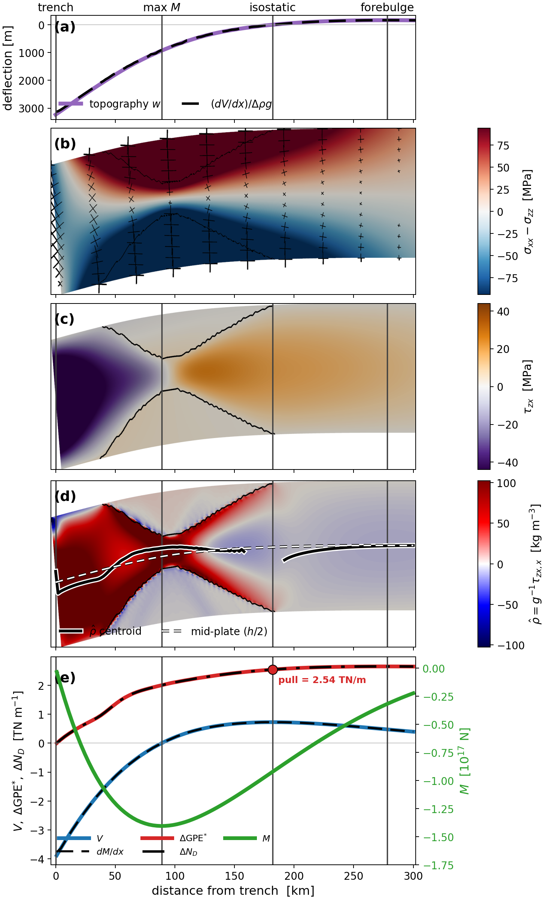

# trench_pull_ferrite


*A 60 km elasto-plastic plate loaded at its trench edge: the deflection grows with the applied shear, creating a pressure deficit
beneath the trench that acts as a horizontal driving force — the trench pull. (24 load steps; `animation/`.)*

Models, analysis and figure code for

> **The 'trench pull' force: constraints from elasto-plastic bending models** — Sandiford (JGR: Solid Earth, submitted 2026).



*The reference model (uniform Tresca, σ_Y = 150 MPa, V = 4 TN/m): topography, stress, the shear stress τzx, the equivalent density
ρ̂ = τzx,x/g that supports the pressure deficit, and the resultants — the trench pull ΔGPE\* = 2.54 TN/m, with the equilibrium
identity ΔN_D = ΔGPE\* holding to 0.02 %.*

Plane-strain, total-Lagrangian finite-element models of a bending lithospheric plate (Ferrite.jl), and the Python
post-processing that turns them into the paper's figures. **All model output data is included** (~100 MB; largest
file 4 MB), so every figure reproduces from this repository alone, without re-running the solver. Re-running the
solver is also supported (§4).

**New here? Open `START_HERE.ipynb`.**

## 1. Layout

```
model/        the solver and the production driver (Julia)
                gpe_mvm.jl, gpe_plastic.jl   massless plane-strain flexure; in-plane Tresca / plane-strain J2 plasticity
                paper_models.jl              every model in the paper is a command of this script
                idealized_beam.jl            the beam benchmarks (SI S1, S2)
analysis/     gpe_analysis.py — deformed-mesh Cauchy integration, trench pull ΔGPE*, equivalent density ρ̂
figures/      one render_*.py per manuscript figure (see REPRODUCE.md)
schematic/    TikZ sources for Figures 1, 2 and the SI stress-regime grid
data/         all model output, one folder per manuscript suite: suite1_strength, suite2_load, suite3_background,
              suite4_thickness, appendixB_esweep; idealized_beam* (benchmarks); reference_figures/ (the shipped renders)
START_HERE.ipynb   the analysis step by step, then on any model, then the paper's figures from their scripts
REPRODUCE.md       figure → script → data → command, for every figure in the paper
```
Data folders are named after the manuscript's suites; the driver's *commands* stay descriptive (`v_sweep` → `data/suite2_load`, `nd_sweep` → `data/suite3_background`).

## 2. Environments

**Julia** (solver) — Julia 1.10.5, Ferrite.jl 1.4.1, Tensors.jl 1.17.0, pinned in `Project.toml`/`Manifest.toml`:
```bash
julia --project=. -e 'using Pkg; Pkg.instantiate()'
```
**Python** (analysis + figures) — Python 3.12, pyvista 0.46.3, numpy 1.26.4, matplotlib 3.9.1, scipy 1.13.1:
```bash
conda env create -f environment.yml && conda activate ferrite-figs
python -m ipykernel install --user --name ferrite-figs   # so START_HERE.ipynb can select this env as its kernel
```
**TikZ** (Figures 1, 2, SI grid) — [`tectonic`](https://tectonic-typesetting.github.io/); no pdflatex needed.

**Run every command from the repository root.** Scripts locate `analysis/` and `data/` relative to it.

## 3. Reproduce the figures (from the included data)

`REPRODUCE.md` has every figure's exact command. The short version:
```bash
python figures/render_hero.py                 # Fig 3     python figures/render_benchmark.py       # S1
python figures/render_gpe_correlation.py      # Fig 4     python figures/render_mp_benchmark.py    # S2
python figures/render_gpe_compare.py          # Fig 5     python figures/render_core_profiles.py   # S4
python figures/render_profiles.py             # Fig 6     python figures/render_corrected_density.py  # S5
python figures/render_thickness_compare.py    # Fig 7     python figures/render_edge_si.py         # parked SI figure (loaded edge)
python figures/render_esweep_test.py          # App. B (the E-sweep arm quoted in §4.1)
( cd schematic && python gen_equilibration_compare.py && tectonic equilibration_compare.tex \
                && tectonic ridge_trench_overview_v2.tex && tectonic taux_cases.tex )       # Figs 1, 2, SI grid
```
Each script writes its figure into `data/reference_figures/`; the shipped copies are the reference renders.
Expect output-equivalent figures (identical data, layout and numbers) — byte-identical PNGs are not guaranteed
across matplotlib/font builds. Several scripts print the numbers quoted in the paper (e.g. `render_gpe_compare.py`
prints the ~2 % plate-top-arm and ~8 % sea-level-arm reconstruction errors).

Some figures are **renamed when copied into the manuscript**: `thickness_compare.png` → `ferrite_thickness_compare.png`;
`hero_tresca_{30,40}km.png` → `ferrite_hero_h{30,40}.png`; `schematic/taux_cases.pdf` → `fig_taux_cases_grid.pdf`.

The one figure-side exception: the **S2 convergence table** reads `data/convergence/`, which is not included
(regeneration-only, several solves). Its values are in `data/CONVERGENCE.md`; to regenerate, run
`julia --project=. model/paper_models.jl convergence` first.

## 4. Re-run the models

The driver is skip-existing (it will not recompute a model whose output exists — move a directory aside to force a
rerun) and never overwrites. Output goes to `data/<suite>/<model>/`, each with a `provenance.txt` stamp.
```bash
julia --project=. model/paper_models.jl suite1        # Suite 1: four strength models at V = 4 TN/m (the reference set)
julia --project=. model/paper_models.jl v_sweep       # manuscript Suite 2: load sweep V = 1 … 4.5   → data/suite2_load
julia --project=. model/paper_models.jl nd_sweep      # manuscript Suite 3: background N_D = −3 … +3 → data/suite3_background
julia --project=. model/paper_models.jl thickness     # Suite 4: h = 30/40/50 km at matched deflection (secant-tuned V)
julia --project=. model/paper_models.jl esweep        # Appendix B: Young's-modulus sweep
julia --project=. model/paper_models.jl convergence   # SI Table S2 (not part of `all`)
julia --project=. model/paper_models.jl all           # suite1 + nd_sweep + v_sweep + esweep + thickness
julia --project=. model/idealized_beam.jl             # the benchmark beams (S1, S2)
```
Reference model, for orientation: uniform Tresca σ_Y = 150 MPa, h = 60 km, V = 4 TN/m → trench deflection 3233 m,
ΔGPE\* = 2.54 TN/m, with the equilibrium identity ΔN_D = ΔGPE\* satisfied to 0.02 %.

### What is in a model's `gpe_model.vtu` — read this before using the fields directly
The VTU is a VTK XML unstructured grid (ParaView/PyVista-readable) of the **reference (undeformed) mesh**, with the
displacement `u` and these point fields:

| field | what it is |
|---|---|
| `sigma_xx`, `sigma_zz`, `sigma_xz` [Pa] | the **second Piola–Kirchhoff stress S** on the reference configuration — **not Cauchy stress**. The plate tilts by up to a few percent, so S and Cauchy differ by O(slope) mixing — measured on the reference model: up to 5 % of the field scale for τzx, 8 % for σxx−σzz, 9 % for σzz (95th percentile ≈ 4 %). |
| `sigma_xz_cauchy` [Pa] | the true Cauchy shear σxz = J⁻¹F·S·Fᵀ, projected to nodes |
| `dsxz_dx`, `dszz_dz` [Pa/m] | FE spatial gradients **of the Cauchy** σxz and σzz on the deformed geometry; `dsxz_dx` = τzx,x is the equivalent density ρ̂·g |
| `pressure`, `von Mises` [Pa], `plastic_strain`, `yielded` | derived scalars / the yield indicator (0/1) |

**Deformed coordinates are not stored**: the mesh in the file is the reference rectangle; the bent plate is reference + `u`,
formed in post-processing (`gpe_analysis.deformed_line`, `START_HERE.ipynb`'s `plot_field`) or in ParaView with *Warp By Vector* on `u`.
Likewise the stress: `sigma_*` is the 2nd Piola–Kirchhoff stress S (work-conjugate to the Green–Lagrange strain, expressed in material
axes, unchanged by rigid rotation); the Cauchy stress σ = J⁻¹ F S Fᵀ carries it into the lab axes on the deformed body — at these
strains (~0.2 %) essentially a rotation by the local plate tilt.

To work with the **full Cauchy tensor**, use `analysis/gpe_analysis.py`: `Model(dir).cauchy_fields()` pushes all three
components forward (`σ = J⁻¹ F S Fᵀ`, `F = I + ∂u/∂X`) — that is what every number in the paper is computed from.
(Only the shear was exported as Cauchy from Julia because ρ̂ needs its *gradient*, which is clean on the FE side;
the naming is a historical artefact, not a principled scheme.)

## 5. Animations (not in the manuscript)

`animation/` shows the reference model being loaded incrementally — the trench deepening, the equivalent density ρ̂
and the shear stress τzx growing with load — as three short movies, shipped as `.gif` (renders inline on GitHub)
and `.mp4`: `trench_pull_loading`, `trench_pull_rhohat`, `trench_pull_sxz`. They are illustrative and no manuscript
figure depends on them. To regenerate: `julia --project=. animation/gen_frames.jl` solves the reference Tresca
model at 24 load fractions (a model run, minutes; writes `animation/frames/`, not shipped), then
`python animation/render_anim.py`, `render_anim_rho.py`, `render_anim_sxz.py` assemble the movies.

## 6. Citation

Cite the paper above and the solver: Carlsson, K., Ekre, F. & Ferrite.jl contributors, *Ferrite.jl* v1.4.1,
doi:10.5281/zenodo.13862652.
